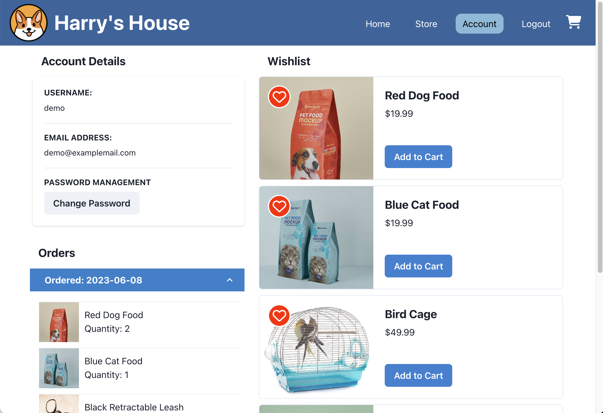
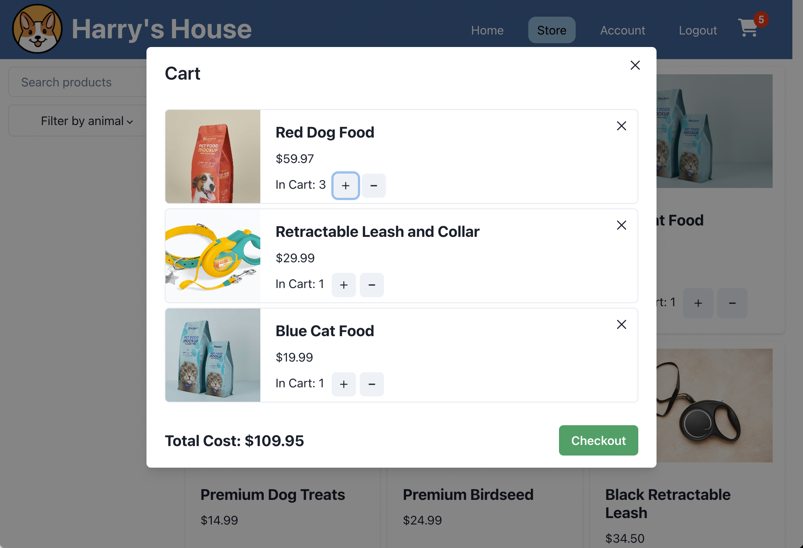

# Harry's House E-commerce Application

Welcome to Harry's House E-commerce Application! This is a full-stack application built that leverages React, Node.js, and PostgreSQL. The use of ChakraUI contributes to the application's appealing and user-friendly design. 

*Harry's House* stocks a wide range of products for dogs, cats, birds, fish, and more. Users can browse the products in the store, using search queries and filters to locate their desired products. Users can create an account to save products in a wishlist, or go straight to adding them to their cart before checking out with the inbuilt Stripe API.  

## Screenshots

  
  
  
  

## Features

- User authentication: Users can sign up, log in, and log out securely.
- Product catalog: Users can browse and search for various products available in Harry's House.
- Shopping cart: Add products to the cart, update quantities, and proceed to checkout.
- Wishlist: Add or remove products to the wishlist for future reference.
- Order management: View and track orders placed by the user.
- Responsive design: The application is optimized for different screen sizes.

## Technologies Used

- React: JavaScript library for building the user interface.
- Node.js: JavaScript runtime environment for server-side development.
- Express: Web application framework for Node.js.
- PostgreSQL: Relational database management system for data storage.
- HTML/CSS: Markup and styling for the application's user interface.
- ChakraUI: Frontend framework for responsive design and UI components.
- RESTful APIs: Backend APIs for communication between the frontend and backend.
- Git and Github: Version control system for tracking changes and collaboration.
- Heroku: Cloud platform for hosting and deploying the application.

## User Stories

- As a customer, I want to be able to browse through a variety of products offered by Harry's House.
- As a customer, I want to be able to search for specific products, so that I can quickly find what I'm looking for.
- As a customer, I want to view detailed product information, including images, descriptions, and prices, so that I can make informed purchasing decisions.
- As a customer, I want to be able to add products to my shopping cart, so that I can keep track of the items I wish to purchase.
- As a customer, I want to be able to adjust the quantity of items in my shopping cart, so that I can easily update my order.
- As a customer, I want to be able to remove items from my shopping cart.
- As a customer, I want to be able to proceed to checkout and provide my shipping and payment information, so that I can complete my purchase.
- As a customer, I want to receive confirmation and order details after completing my purchase, so that I have a record of my transaction.
- As a customer, I want to be able to create an account and log in, so that I can view my order history and easily place future orders.
- As a customer, I want to be able to update my password.

## Database Structure

### users Table

| Column         | Type          | Constraints      |
|----------------|---------------|------------------|
| id             | SERIAL        | PRIMARY KEY      |
| username       | VARCHAR(255)  | UNIQUE NOT NULL  |
| email          | VARCHAR(255)  | UNIQUE NOT NULL  |
| password_hash  | VARCHAR(255)  | NOT NULL         |

### products Table

| Column        | Type          | Constraints            |
|---------------|---------------|------------------------|
| id            | SERIAL        | PRIMARY KEY            |
| name          | VARCHAR(255)  | NOT NULL               |
| img_url       | VARCHAR(255)  |                        |
| description   | TEXT          |                        |
| stock         | INT           | NOT NULL               |
| price         | DECIMAL(10, 2)| NOT NULL               |
| category      | INT           | NOT NULL               |
| created_at    | TIMESTAMP     | DEFAULT CURRENT_TIMESTAMP |

### wishlist_products Table

| Column       | Type    | Constraints         |
|--------------|---------|---------------------|
| user_id      | INT     | NOT NULL            |
| product_id   | INT     | NOT NULL            |
| FOREIGN KEY  |         | (user_id) REFERENCES users (id)    |
| FOREIGN KEY  |         | (product_id) REFERENCES products (id) |

### orders Table

| Column       | Type    | Constraints            |
|--------------|---------|------------------------|
| id           | SERIAL  | PRIMARY KEY            |
| user_id      | INT     | NOT NULL               |
| created_at   | TIMESTAMP | DEFAULT CURRENT_TIMESTAMP |
| FOREIGN KEY  |         | (user_id) REFERENCES users (id) |

### order_items Table

| Column       | Type          | Constraints               |
|--------------|---------------|---------------------------|
| id           | SERIAL        | PRIMARY KEY               |
| order_id     | INT           | NOT NULL                  |
| product_id   | INT           | NOT NULL                  |
| quantity     | INT           | NOT NULL                  |
| price        | DECIMAL(10, 2)| NOT NULL                  |
| FOREIGN KEY  |               | (order_id) REFERENCES orders (id)    |
| FOREIGN KEY  |               | (product_id) REFERENCES products (id) |

## Installation

To run the Harry's House E-commerce Application locally, follow these steps:

1. Clone the repository: `git clone https://github.com/justinKenealy/harrys-house.git` or through SSH `git clone git@github.com:justinKenealy/harrys-house.git`
2. Navigate to the project directory: `cd harrys-house`
3. Install the dependencies for the frontend: `cd client && npm install`
4. Install the dependencies for the backend: `cd ../server && npm install`
5. Set up the PostgreSQL database: Create a database and configure the connection in your own .env file in the /server route
6. Navigate to /server/db directory and run the schema and seed files
    - `psql -d YOUR-DB-NAME < "schema.sql"`
    - `psql -d YOUR-DB-NAME < "seed.sql"`
7. Navigate back to the /server route and start the backend server `node app.js`
8. Navigate to the /client route and start the frontend server `npm run dev`
8. Open your browser and visit `http://localhost:5173` to see the application.

## Testing

This project includes a suite of tests to ensure its functionality. The tests are written using the vitest framework and can be executed as follows:

1. Ensure all project dependencies are installed on the frontend: `cd client && npm install`
2. If necessary, navigate to the client directory: `cd client`
3. Run the testing command `npm test`

Each test file contains multiple test cases, which are written using the and 'it' function. Within each test case, assertions are made using various testing methods to verify the expected behavior of the code.

## Contact

If you have any questions or need further assistance, please feel free to contact the at justinmkenealy@gmail.com

Happy shopping at Harry's House E-commerce
