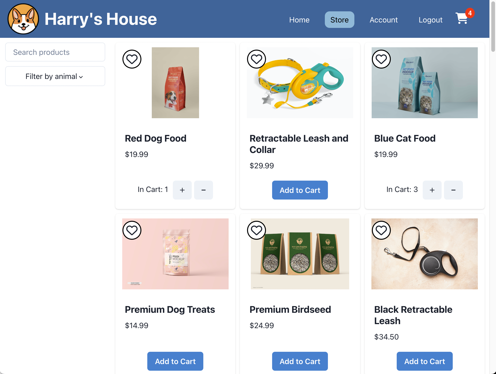

# Harry's House E-commerce Application

Welcome to Harry's House E-commerce Application! This is a full-stack application built with React for the frontend, Node.js and Express for the backend, and PostgreSQL for the database. 

*Harry's House* stocks a wide range of products for dogs, cats, birds, fish, and more. Users can browse the products in the store, using search queries and filters to locate their desired products. Users can create an account to save products in a wishlist, or go straight to adding them to their cart before checking out with the inbuilt Stripe API.  

## Screenshots

  
  

## Features

- User authentication: Users can sign up, log in, and log out securely.
- Product catalog: Browse and search for various products available in Harry's House.
- Shopping cart: Add products to the cart, update quantities, and proceed to checkout.
- Wishlist: Add or remove products to the wishlist for future reference.
- Order management: View and track orders placed by the user.
- Responsive design: The application is optimized for different screen sizes and devices.

## Technologies Used

- React: JavaScript library for building the user interface.
- Node.js: JavaScript runtime environment for server-side development.
- Express: Web application framework for Node.js.
- PostgreSQL: Relational database management system for data storage.
- HTML/CSS: Markup and styling for the application's user interface.
- ChakraUI: Frontend framework for responsive design and UI components.
- RESTful APIs: Backend APIs for communication between the frontend and backend.
- Git and Github: Version control system for tracking changes and collaboration.
- Heroku: Cloud platform for hosting and deploying the application.

## Installation

To run the Harry's House E-commerce Application locally, follow these steps:

1. Clone the repository: `git clone https://github.com/justinKenealy/harrys-house.git` or through SSH `git clone git@github.com:justinKenealy/harrys-house.git`
2. Navigate to the project directory: `cd harrys-house`
3. Install the dependencies for the frontend: `cd client && npm install`
4. Install the dependencies for the backend: `cd ../server && npm install`
5. Set up the PostgreSQL database: Create a database and configure the connection in your own .env file in the /server route
6. Navigate to /server/db directory and run the schema and seed files
    - `psql -d YOUR-DB-NAME < "schema.sql"`
    - `psql -d YOUR-DB-NAME < "seed.sql"`
7. Navigate back to the /server route and start the backend server `node app.js`
8. Navigate to the /client route and start the frontend server `npm run dev`
8. Open your browser and visit `http://localhost:5173` to see the application.

## Contact

If you have any questions or need further assistance, please feel free to contact the me at justinmkenealy@gmail.com

Happy shopping at Harry's House E-commerce